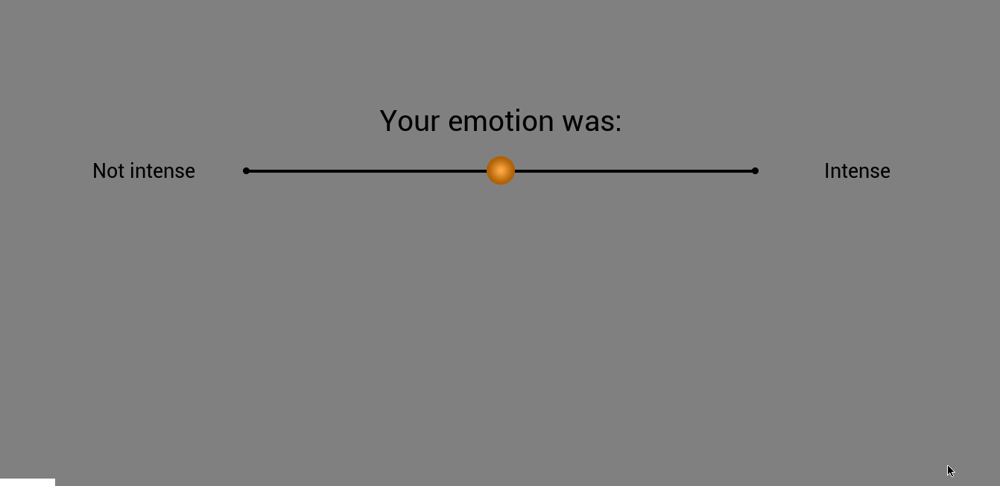

# AffectiveTask
Basic affective task (rating of emotional pictures) that can be used to test neurophysiological equipment.

## Description
The AffectiveTask is designed to assess affective event-related brain potentials (ERPs) using visual pictures 
that were highly distinct on arousal level/valence category ratings.

The task is simple and straight forward. There are 60 trials in total. In each trial, an affective stimulus (picture) is presented for *3.0 seconds* 
and participants are asked to give the respective ratings of their emotion on two visual analogue scales - one for the level of arousal (Not intense - Intense) and one for level of valence (Positive - Negative). 



Visual pictures are selected from the Nencki Affective Picture System (NAPS), which consists of 1,356 realistic, high-quality photographs (Marchewka, Zurawski, Jednoróg, & Grabowska, 2014).

## Installation
Download and run the experiment in Python: source("https://github.com/neuropsychology/AffectiveTask/blob/master/task_rating.gif")

Packages needed:
- [neuropsydia] (pip install https://github.com/neuropsychology/Neuropsydia.py/zipball/master)
- numpy
- pandas
- random

## How to run the task

### Download the NAPS stimuli

To request for NAPS images for non-profit academic research purposes:https://lobi.nencki.gov.pl/research/8/

[Marchewka, A., Zurawski, L., Jednoróg, K., & Grabowska, A. (2014). *The Nencki Affective Picture System (NAPS): Introduction to a novel, standardized, wide-range, high-quality, realistic picture database*. Behavior research methods, 46(2), 596-610.](https://www.ncbi.nlm.nih.gov/pubmed/23996831)

After obtaining the NAPS pictures, you can copy the selected NAPS images to the **AffectiveTask/stimuli** folder, or change the path directly in the experiment script.

```
# Define the path where the images stimuli are stored
path = "./stimuli/"

```

### Stimuli Selection

Currently, there are 60 NAPS images selected for the AffectiveTask. Please refer to the `stimuli_list.csv`. 

All selected stimuli belong to the **People/Faces Category**. Half of them are categorized as *Neutral* and the other half as *Negative*. 

We have plotted the affective ratings of 60 selected stimuli; the ratings include **valence** (ranging from highly negative to highly positive), **arousal** 
(ranging from relaxed/unaroused to excited/aroused), and **approach–avoidance** (ranging from a tendency to avoid to a tendency to approach a stimulus). 


Based on the original ratings of the stimuli, the two groups, *Neutral* and *Negative*, are distinctively different on the **arousal** and **valence** dimensions. 

## Data

- Download the .zip file from [**here**](https://drive.google.com/open?id=1y62XlW9ovWhUrIg1uXdR09QbXayGEWdt)
- Unzip and extract the folders within this file (named `S1`, ...) in the `/data/` folder.